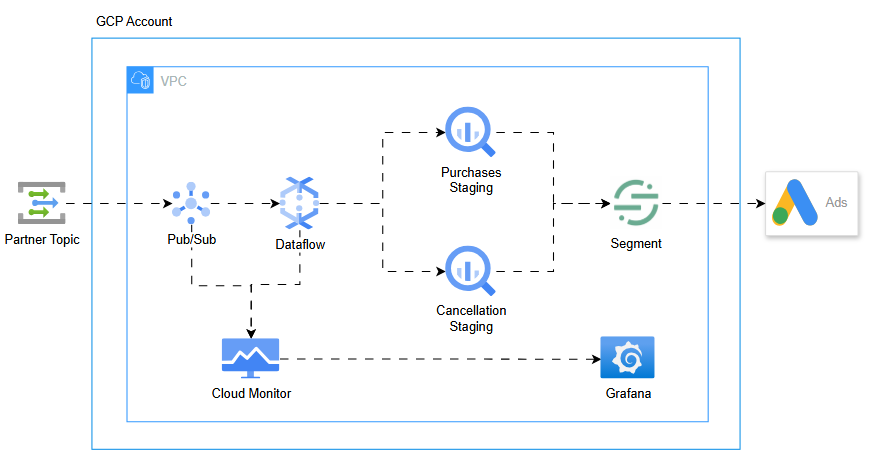

# Real-Time Automotive Events Pipeline (GCP)



## Objective

This project implements a real-time automotive events pipeline on Google Cloud Platform.
The goal is to ingest partner events (purchases and cancellations), validate and route them in-stream, store them for analytics and activation, and make the events available for downstream marketing systems (Segment → Google Ads).

## Design Trade-offs

### ✅ Streaming instead of Batch

#### Why
- Faster activation of high-intent users
- Immediate availability for marketing campaigns
- Demonstrates low-latency ingestion patterns

#### Trade-off
- Higher complexity vs cron-batch ingestion
- Operational considerations (backpressure, DLQ, monitoring)

### ✅ Dataflow instead of Pub/Sub → BigQuery direct sink

The simpler option would be:
Pub/Sub → BigQuery subscription sink

#### Why
- Validates schema and timestamps
- Filters invalid events early
- Splits traffic into two distinct staging tables
- Future-proofing for enrichment/transforms if needed

#### Trade-off
- Higher complexity vs automatic ingestion
- Slightly higher cost, but gains control and observability

### ✅ BigQuery as staging instead of GCS

#### Why

- Native streaming sink
- Avoids building file buffers on GCS
- Simpler connector to Segment later
- Enables direct SQL-based debugging and auditing

#### Trade-off

More expensive than GCS object storage

But eliminates intermediate batch job cost and complexity

### ✅ BigQuery for raw logs instead of Bigtable

#### Why
- Cheaper for small/medium event volumes
- Simpler querying and auditing
- BT ideal for ultra-high throughput + low-latency key lookups, not needed here

#### Trade-off
- BT read performance at scale
- Ultra low-latency stateful access

Conclusion: BQ is correct for audit trail + cost efficiency

### ✅ Segment (CDP)

A Customer Data Platform (CDP) that centralizes customer events and routes them to downstream tools like Google Ads. It standardizes, enriches, and distributes behavioral and transactional data.

#### Why

- Native connectors with Ads and marketing systems
- Central place to manage event routing and activation
- Supports schema governance and tracking plans
- Enables channel toggling and experimentation without code deployments

#### Trade-off
- Higher cost vs direct push to Ads
- Additional point of failure if misconfigured
- Requires proper schema discipline to avoid event drift

### ✅ Managed Grafana vs only Cloud Monitoring

#### Why
- Native to GCP, no infra to manage (managed, not serverless)
- Better dashboards for data pipelines
- Can join product metrics + infra metrics if needed

#### Trade-off
- Extra component vs sticking to Cloud Monitoring only
- But observability is clearer and more flexible

## How to Reproduce
### 1. Deploy infrastructure
```bash
terraform init
terraform apply -auto-approve
```

### 2. Build and store Dataflow template (CI pipeline handles it)
```bash
python dataflow/main.py \
  --runner DataflowRunner \
  --project $PROJECT_ID \
  --region us-central1 \
  --temp_location gs://cars-sales-$PROJECT_ID-prod-dataflow-temp/temp \
  --template_location gs://cars-sales-$PROJECT_ID-prod-dataflow-temp/template/main-template
```

### 3. Trigger Dataflow job (Terraform creates it)

### 4. Send test events
```bash
python tests/test.py
```

### 5. Query staging tables
```sql
SELECT * FROM streaming.staging_purchase;
SELECT * FROM streaming.staging_cancellation;
```

## Future Enhancements

- DLQ + retry topic for invalid events
- dbt models for staging → curated layer
- Optional CDC export to real-time ML features
- Expand monitoring with latency SLIs and Pub/Sub lag